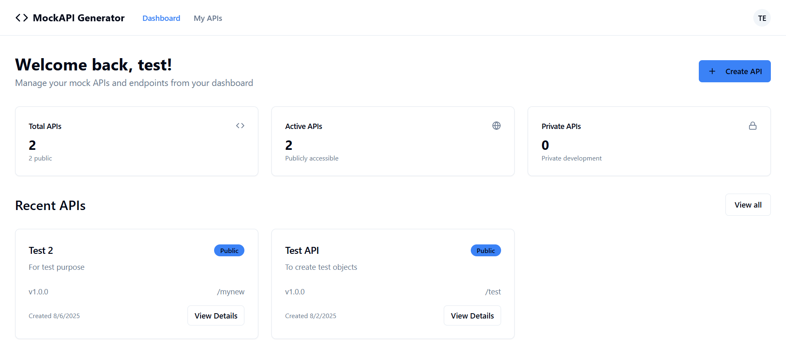
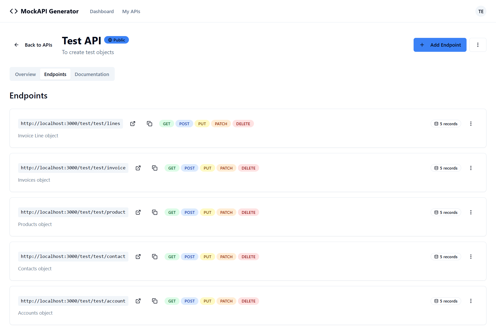
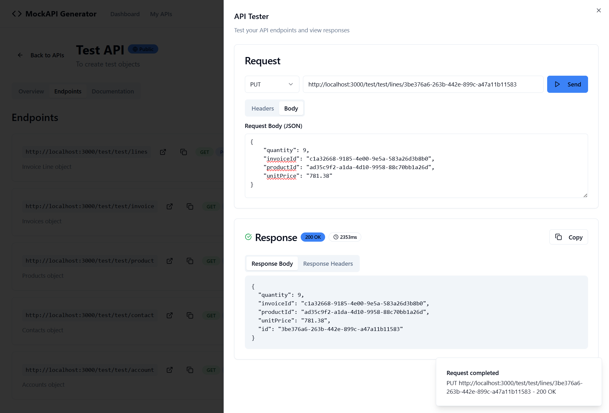
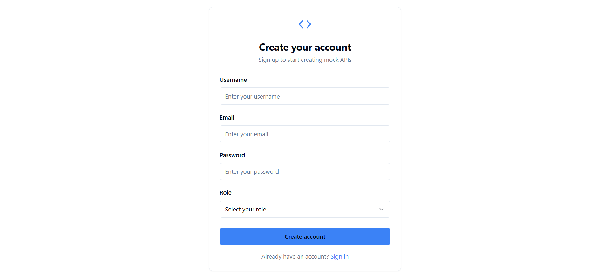

# Mock API Generator
**Build, manage, test and share production-grade mock APIs in minutes — no backend required.**

Perfect for frontend devs, prototyping, QA, and simulating real-world APIs while the real backend catches up.


[](https://github.com/IbrahimNazir/mock-api-generator)
[](https://github.com/IbrahimNazir/mock-api-generator)
[](https://opensource.org/licenses/MIT)
[](https://www.typescriptlang.org/)
[](https://react.dev/)

---
## **[Live Demo](https://mock-api-generator.onrender.com)**

## Table of Contents

- [Key Features](#key-features)
- [UI Walkthrough & Experience](#ui-walkthrough--experience)
  - [Dashboard & Analytics](#dashboard--analytics)
  - [API Management](#api-management)
  - [Endpoint Management](#endpoint-management)
  - [Built-in API Testing Tool](#built-in-api-testing-tool)
  - [Authentication & Security](#authentication--security)
- [Query Parameters for Mock API Endpoints](#query-parameters-for-mock-api-endpoints)
  - [Supported Query Parameters](#supported-query-parameters)
  - [Filtering – Bracket Notation](#filtering--bracket-notation)
- [Tech Stack](#tech-stack)
- [Installation & Setup](#installation--setup)
- [Usage](#usage)
- [Contributing](#contributing)
  
## Key Features

- **Smart Filtering**  
  Filter API responses by any field → get exactly the data slice you need for different test scenarios

- **Built-in Pagination**  
  Automatic pagination support with custom page sizes, offsets, and navigation — behaves like real-world APIs

- **Response Delays**  
  Add realistic network latency (configurable ms) to test loading states, spinners, skeletons & timeouts

- **Request Validator**  
  Validate the request body based on the validations defined while creating the schema.

- **Faker Integration**  
  Generate lifelike mock data on-the-fly: names, addresses, emails, phones, dates, products, finance, etc. using Faker.js

- **Nested Data Support**  
  Build complex, deeply nested JSON structures — objects inside arrays, arrays inside objects — exactly like production APIs

- **Data Relationships**  
  Link related entities (users → their posts, orders → customer + items, etc.) for consistent, relational mock data

- **Integrated Real-time Testing Tool** (Postman-style, but better — inside your app)  
  - All HTTP methods (GET, POST, PUT, DELETE, PATCH…)  
  - Custom headers, JSON body editor with validation  
  - Instant responses: pretty-printed JSON, status codes, timing, headers  
  - One-click copy response / headers

- **Private API**  
  Create private apis with JWT Bearer token for authorization

Plus:
- Clean **Dashboard** with stats, recent APIs, public/private overview
- Full **API & Endpoint CRUD** — descriptions, visibility control
- **Schema Builder** for defining requests/responses
- Secure **Auth** (login/register) with protected routes
- Modern, responsive UI (Tailwind + shadcn/ui)

  
## UI Walkthrough & Experience

### Dashboard & Analytics

- **Overview Dashboard**: Get insights into your API portfolio with statistics cards
- **Recent APIs**: Quick access to your most recently created APIs
- **User-friendly Stats**: Track total APIs, active public APIs, and private APIs

### API Management


- **Create APIs**: Easy-to-use forms for creating new mock APIs
- **API Organization**: Manage APIs with version control, descriptions, and visibility settings
- **Public/Private APIs**: Control access to your APIs with visibility settings
- **Search & Filter**: Quickly find APIs using the built-in search functionality

### Endpoint Management


- **CRUD Operations**: Create, read, update, and delete API endpoints
- **HTTP Methods**: Support for all standard HTTP methods (GET, POST, PUT, DELETE, etc.)
- **Schema Builder**: Define request/response schemas for your endpoints, with validations.
- **Detailed Configuration**: Set up complex endpoint behaviors and responses

### Built-in API Testing Tool



- **Interactive Testing**: Test your API endpoints directly from the interface
- **Request Configuration**: 
  - HTTP method selection
  - Custom headers management
  - JSON request body editor with validation
- **Response Analysis**:
  - Formatted JSON response display
  - HTTP status codes and response times
  - Response headers inspection
  - Copy response functionality


### Authentication & Security



- **User Authentication**: Secure login and registration system
- **Protected Routes**: Ensure only authenticated users can access the platform
- **User Profiles**: Manage user information and preferences

## Query Parameters for Mock API Endpoints

Your mock APIs are designed to feel like real-world REST APIs, with support for filtering, pagination, delays, and single-item retrieval.

GET /:username/:apiBasePath/:endpointPath[/:resourceId]

textExamples:
- List all: `/ibrahim/shop/products`
- Single item: `/ibrahim/shop/products/acde070d-8c4c-4f0d-9d8a-162843c10333`
- With params: `/ibrahim/shop/products?name[like]=phone&price[gte]=500&delay=1200`

### Supported Query Parameters

| Parameter      | Purpose                                      | Example                                      | Default       | 
|----------------|----------------------------------------------|----------------------------------------------|---------------|
| `page`         | Pagination – which page to return            | `?page=3`                                    | 1             |
| `limit`        | Number of items per page                     | `?limit=20`                                  | infinite            |
| `delay`        | Simulate network latency (milliseconds)      | `?delay=1500`                                | 0             |
| Filtering      | Filter results by any field in your data     | `?name[like]=ali&age[gte]=18`                | —             |

### Filtering – Bracket Notation

Use **bracket notation** (`field[operator]=value`) – it's clean, readable, and matches modern API conventions.

Supported operators:

| Operator     | Meaning                               | Bracket Example              |
|--------------|---------------------------------------|--------------------------------------------|
| (none)       | Equals                                | `?status=active`                           | 
| `eq`         | Equals (explicit)                     | `?status[eq]=active`                       | 
| `gt`         | Greater than                          | `?age[gt]=25`                              |
| `gte`        | Greater than or equal                 | `?price[gte]=100`                          | 
| `lt`         | Less than                             | `?score[lt]=90`                            |
| `lte`        | Less than or equal                    | `?age[lte]=35`                             |
| `like`       | Contains substring (case-insensitive) | `?name[like]=ali`                          |

## Tech Stack

- **Frontend**: React, TypeScript
- **Styling**: Tailwind CSS, shadcn/ui components
- **Backend**: Express, PostgreSQL
- **Routing**: React Router DOM
- **Build Tool**: Vite
- **UI Components**: Radix UI primitives
- **Icons**: Lucide React
- **Form Handling**: React Hook Form + Zod validation

## Installation & Setup

### Prerequisites
- Node.js (v18 or higher)
- npm or yarn package manager

### 1. Clone the Repository
```bash
git clone https://github.com/IbrahimNazir/mock-api-generator
cd mock-api-generator
```

### 2. Install Dependencies & Run Dev
```bash
cd frontend
npm install
npm run dev
```

### 3. Build for Production
```bash
npm run build
# or
yarn build
```

## Usage

1. **Sign Up/Login**: Create an account or login to access the platform
2. **Create Your First API**: Use the "Create API" button to define your API
3. **Add Endpoints**: Define endpoints with HTTP methods, paths, and responses
4. **Test Your API**: Use the built-in testing tool to verify endpoint behavior
5. **Manage & Share**: Set APIs as public/private and share with your team

## Contributing

1. Fork the repository
2. Create a feature branch (`git checkout -b feature/amazing-feature`)
3. Commit your changes (`git commit -m 'Add some amazing feature'`)
4. Push to the branch (`git push origin feature/amazing-feature`)
5. Open a Pull Request

Built with ❤️ by [Ibrahim Nazir](https://github.com/ibrahimnazir)
