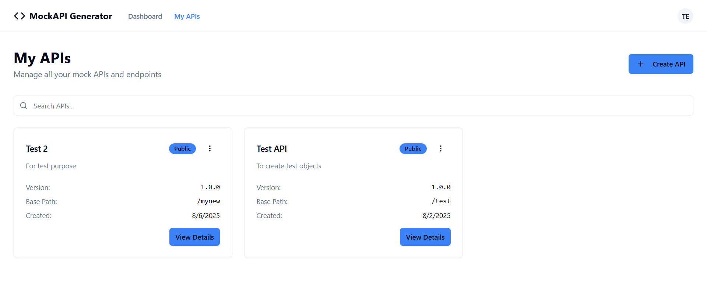
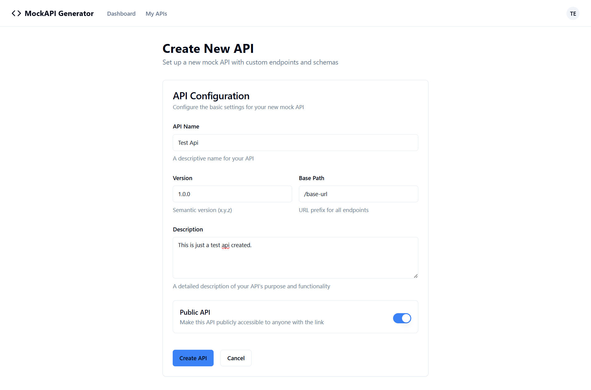
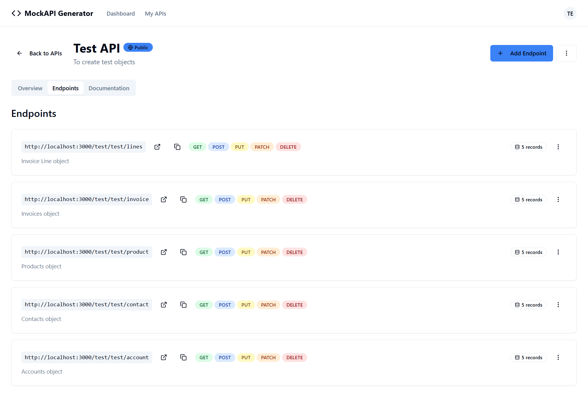
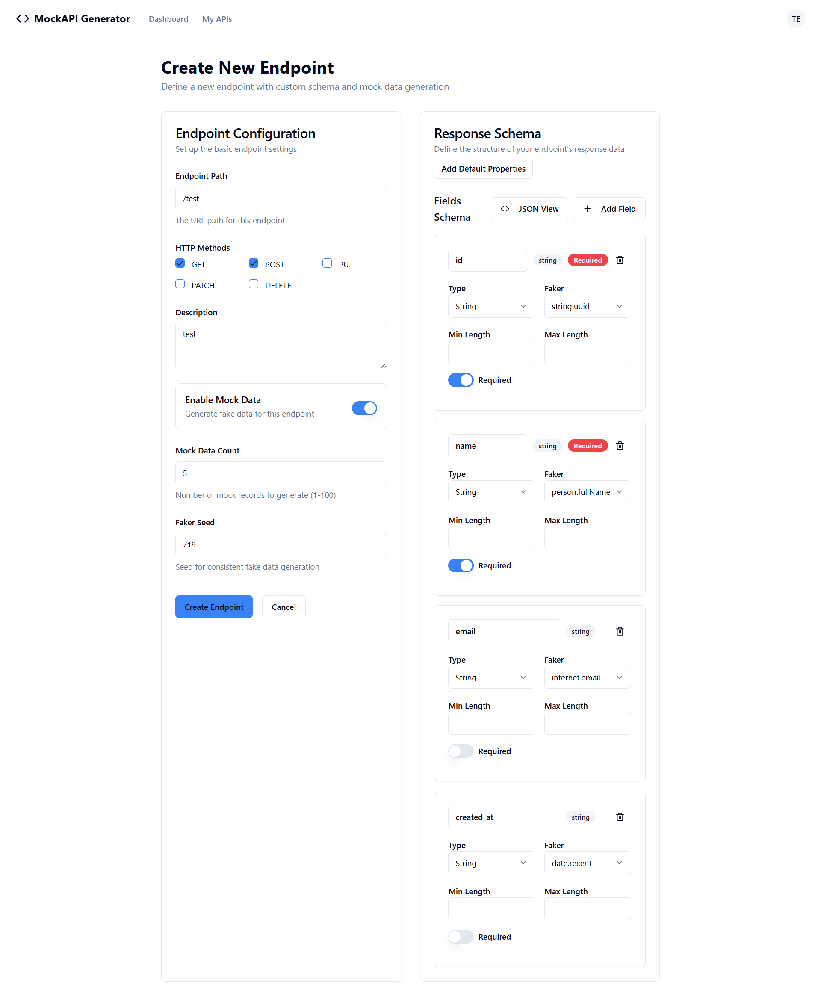
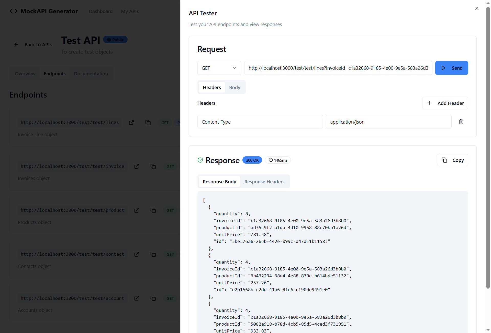
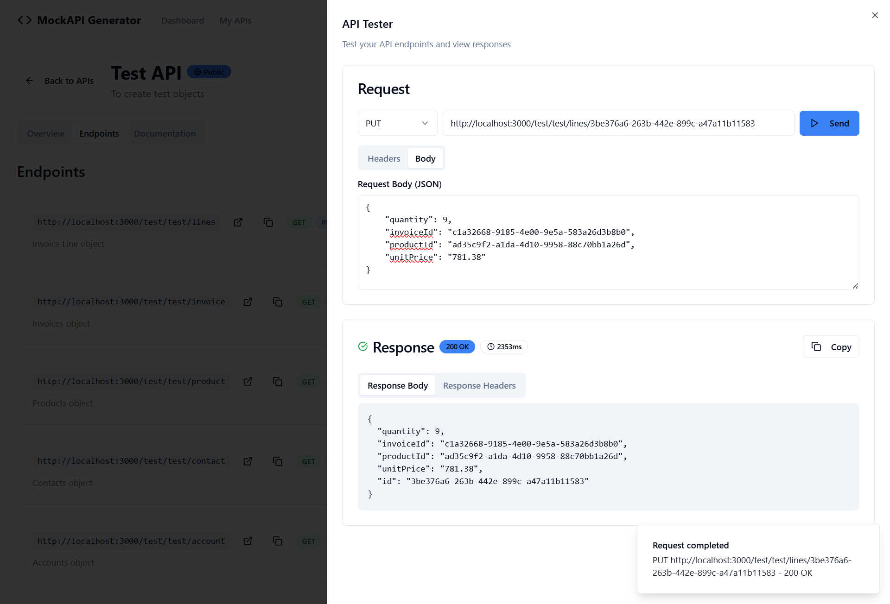
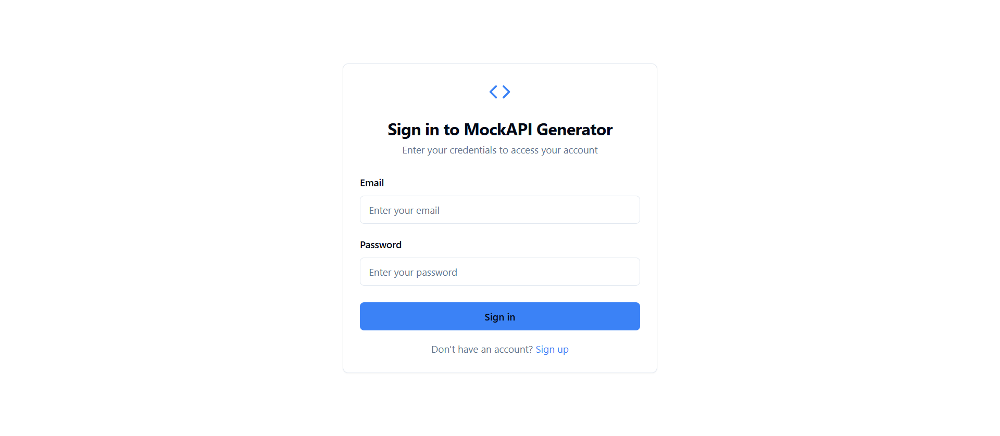
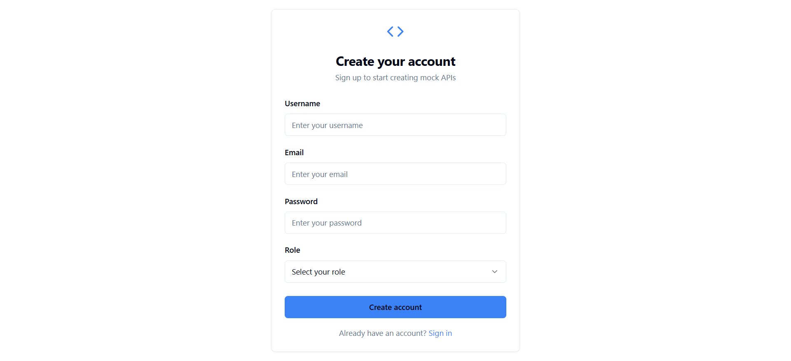

# API Management & Testing Platform

A comprehensive web application for creating, managing, and testing mock APIs. Built with modern technologies including React, and TypeScript for a seamless developer experience.


## Features

### Dashboard & Analytics

- **Overview Dashboard**: Get insights into your API portfolio with statistics cards
- **Recent APIs**: Quick access to your most recently created APIs
- **User-friendly Stats**: Track total APIs, active public APIs, and private APIs

### API Management


- **Create APIs**: Easy-to-use forms for creating new mock APIs
- **API Organization**: Manage APIs with version control, descriptions, and visibility settings
- **Public/Private APIs**: Control access to your APIs with visibility settings
- **Search & Filter**: Quickly find APIs using the built-in search functionality

### Endpoint Management


- **CRUD Operations**: Create, read, update, and delete API endpoints
- **HTTP Methods**: Support for all standard HTTP methods (GET, POST, PUT, DELETE, etc.)
- **Schema Builder**: Define request/response schemas for your endpoints
- **Detailed Configuration**: Set up complex endpoint behaviors and responses

### Built-in API Testing Tool



- **Interactive Testing**: Test your API endpoints directly from the interface
- **Request Configuration**: 
  - HTTP method selection
  - Custom headers management
  - JSON request body editor with validation
- **Response Analysis**:
  - Formatted JSON response display
  - HTTP status codes and response times
  - Response headers inspection
  - Copy response functionality


### Authentication & Security



- **User Authentication**: Secure login and registration system
- **Protected Routes**: Ensure only authenticated users can access the platform
- **User Profiles**: Manage user information and preferences

## Tech Stack

- **Frontend**: React, TypeScript
- **Styling**: Tailwind CSS, shadcn/ui components
- **Backend**: Express, PostgreSQL
- **Routing**: React Router DOM
- **Build Tool**: Vite
- **UI Components**: Radix UI primitives
- **Icons**: Lucide React
- **Form Handling**: React Hook Form + Zod validation

## Installation & Setup

### Prerequisites
- Node.js (v18 or higher)
- npm or yarn package manager

### 1. Clone the Repository
```bash
git clone https://github.com/IbrahimNazir/mock-api-generator
cd mock-api-generator
```

### 2. Install Dependencies & Run Dev
```bash
cd frontend
npm install
npm run dev
```

### 3. Build for Production
```bash
npm run build
# or
yarn build
```

## Usage

1. **Sign Up/Login**: Create an account or login to access the platform
2. **Create Your First API**: Use the "Create API" button to define your API
3. **Add Endpoints**: Define endpoints with HTTP methods, paths, and responses
4. **Test Your API**: Use the built-in testing tool to verify endpoint behavior
5. **Manage & Share**: Set APIs as public/private and share with your team

## Contributing

1. Fork the repository
2. Create a feature branch (`git checkout -b feature/amazing-feature`)
3. Commit your changes (`git commit -m 'Add some amazing feature'`)
4. Push to the branch (`git push origin feature/amazing-feature`)
5. Open a Pull Request
